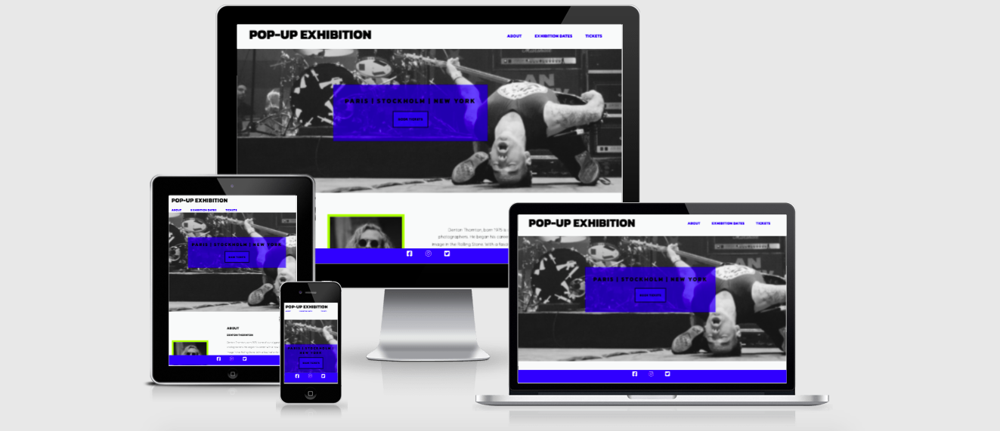
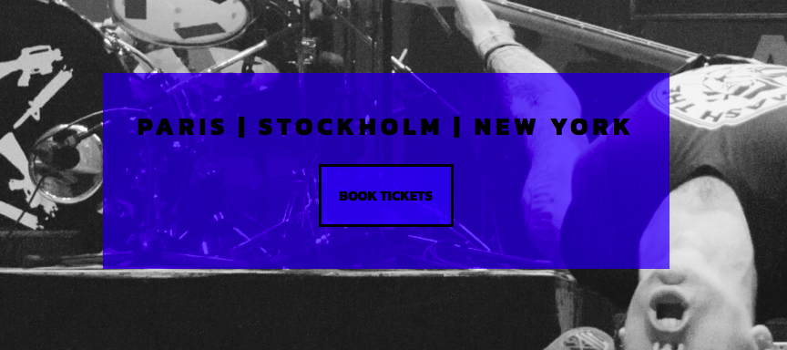

# Pop-up Exhibition

This Pop-up Exhibition site is covering all the user needs to know about the famous music photographer Denton Thornton's first ever pop-up exhibition that will be presented in three cities globally and the source to get access to the limited free tickets. 

## Features

### Existing Features

Pop-up Exhibition is a one-page fully responsive home page with fixed navigation bar at the top for quick and easy access to the sections with the call to action for users to book their tickets.

* **Navigation bar:**
    * A fully responsive navigation bar that takes the user to the different sections _About_, _Exhibition Dates_ and _Book Tickets_ further down on the home page, that allows the user to read about the photographer, see the exhibition dates and finally book the limited tickets to chosen exhibition location. 
    * The fixed navigation bar allows the viewer to easily access the requested sections.
    * Logo is clickable and takes the user to the top of the page. 

* **Cover section:**
    * This section should attract the user to visit the exhibition with a one of the photographers most famous photograph. 
    * There is a cover-box that highlights the three cities the exhibition will be shown in and a call-to-action button to encourage the users to book their tickets. 
    The cover box is fully responsive and is a fixed box on smaller devices. 

* **About section:**
    * The About section is for the user to read into who he is and be intruiged to visit the exhibition. 
    * The About section is also featuring a photo of the photographer himself. 
    * An audio snippet has been added with controls

* **Gallery section:**
    * For those who doesn't know Denton Thorntons work there is a small gallery selection to showcase some of his biggest photographs. 
    * Photos was resized to fit the banner to 300px and cover image was compressed not to take too long to load on the page. All photos have been uploaded to the 'assets/images/' folder. 

* **Exhibition Dates section:**
    * A list of the current set dates of the exhibition featuring three cities and its location. 

* **Book Tickets section:**
    * A form that allows the user to book their tickets by filling out first name, surname and email and finally the requested location in forms of radio buttons. All fields are _required_ and must be filled out by the user before submitting their form.

* **Footer section:**
    * A fixed footer for easy access to the social media links. 
    * The icons direct the user to the social media pages in a new window for the user to follow news and updates, not having to loose access to the current webpage. 

### Features Left to Implement

A potential webshop to sell small posters when the exhibition is on. 

## Testing

### Functionality Testing

All links have been tested and clicked on to confirm they are pointing to the correct end-destination, both during the building of the site and a final check before deploying. 
I used Chrome developer tools throughout the project for testing and solving problems with responsiveness and style issues and to see how changes effected the rest of the site. 

Unicorn Revealer extension to chrome browser was very helpful with a padding issue I could not find in Developer Tools. 

Setting up the site and it's structure and styling was quite unproblematic, going through one section at the time and testing it live before moving on to the next one. However I had the following issues:

* Container with width:100% changing size when inside button border gets bold on hover.
I could have changed the 100% container to fixed size but wanted it to be responsive to the screen and tried different position attributes but with no luck. In the end I got assistance from the support team to set position to absolute and height to fit-content. 

* I wanted to change margin-bottom on "p" descending from #form. After a few trial and errors I realised that on the top of the terminal there is a "descending list" of the elements and came to the understanding it was not a child of #form, but of _label_. I tried as id, class and then finally just label > h4 and it worked.

 * There were quite a few buttons I wanted centered within a container and the attribute "margin:0 auto;" didn't work. I realised I had to add a new "div" containing only the button (because I didn’t want all text to be centered, although that would have been the easiest) and added class="center". I could then change that div with text-align:center attribute. 

* Cover image didn't show below header as I wanted. After some reasearch on Google I realised I had not added any height to the header section. When I did that the cover image was placed below as wanted.

* When making the site responsive it turned out I had a lot of padding on the right which pushed content to the left. I could not see this padding in the _Inspector_ at all and had to ask the tutors for help. With some suggestions to download the extension "Unicorn Reveler" I could see the padding that was disturbing the layout and reduce it to make it look nice. 

* In the first HTML check a header to the Gallery section was missed. I tried to add it but decided that visually it wouldn't look good and trust the images speak for themselves. I therefor decided to add it to the HTML file for screenreaders to see but to hide it for the viewers with CSS.

The site is made to be responsive to devices down to 500px and smaller. The aim was to keep the flow as much as possible but following changes was made responsive:

* At 1200px the Navigation bar doesn't fit the screen anymore so it was set to the left below the logo instead of to the right, and slightly smaller font size at this breakpoint.
* The About section has been split to two blocks on top of eachother on devices from 750px and smaller instead of side by side as it is on desktop view. The 750px was the breakpoint where it started to look unpleasant.
* At 500px and smaller all elements have been centralised for a nicer flow for the viewer. 

### Compatibility testing
Site was tested across multiple mobile devices and browsers. I checked all supported devices in Chrome Developer Tools with the smallest device being Iphone 5. 
   
## Validator Testing

* HTML
    * No errors were detected when passing through the [HTML W3C Validator](https://validator.w3.org/nu/).

* CSS
    * No errors were detected when passing through the [Jigsaw Validator](https://jigsaw.w3.org/css-validator/).

* Accessibility 

    * I confirm that the colors and font chosen is easy to read and have been run through Lighthouse in Devtools.

### Unfixed Bugs

No unfixed bugs have been detected.

## Deployment

The page has been deployed to Github Pages following below steps:

1. On the Github repository page navigate to _Settings_ in the menu field. 
2. Scroll down to _Pages_
3. Under _Source_ change the branch to _main_
4. Press _Save_
5. The site is published and can be found [here](https://viktoriamahrberg.github.io/pop-up-exhibition/).

To run localy:

1. On the Github repository page, click _Code_ button do download zip file
2. After download you can extract the file and use it in your local environment.

## Credits

**Content**

* To complete this project I used Code Institute [Github Template](https://github.com/Code-Institute-Org/gitpod-full-template)
* Assistance is coming from the tutors at Code Institute 
* Assistance is coming from my Mentor Adeye Gbenga.
* Tutorials, ideas and knowledge:
    * [Stackoverflow](https://stackoverflow.com/) 
    * [w3schools.com](https://www.w3schools.com/)
* Fonts and Icons:
    * [Font Awsome](https://fontawesome.com/)
    * [Google Fonts](https://fonts.google.com/) ("Archivo Black" and Kanit)

**Media**

* Photos: [Stocksnap.io](https://stocksnap.io/)
* Audio: [Audiomicro](https://www.audiomicro.com/).

